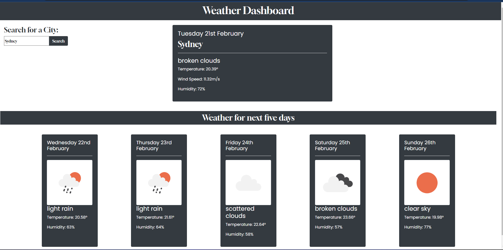

# weather-dashboard
Find the weather forecast for the next 5 days
## Overview

This application was designed to display the weather forecast for today and the next five days. The application retrieves data from the OpenWeatherMap API. 

## Technologies used

HTML, CSS, JavaScript, Bootstrap, jQuery, and Moment.js

## Screenshot

  

## Link to Deployed Site

https://jaycee808.github.io/weather-dashboard/

